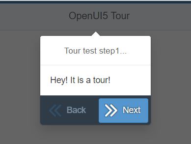

# openui5-tour
An OpenUI5 Control which helps developers to create a step-by-step guided tour through their UI5 apps.
OpenUI5 Tour enables an user-friendly way to showcase products and features in your website.


## Demo
You can checkout a live demo here:

https://mauriciolauffer.github.io/openui5-tour/demo/webapp/index.html

[](https://raw.githubusercontent.com/mauriciolauffer/openui5-tour/master/openui5-tour.png)


## Project Structure
* demo - Demo site for the library
* dist - Distribution folder that contains the library ready to use
* src  - Development folder
* test - Testing framework for the library


## Getting started

### Installation
Install openui5-tour as an npm module
```sh
$ npm install openui5-tour
```

### Configure manifest.json
Add the library to *sap.ui5/dependencies/libs* and set its path in *sap.ui5/resourceRoots* in your manifest.json file, as follows:

```json
{
  "sap.ui5": {
    "dependencies": {
      "libs": {
        "openui5.tour": {}
      }
    },
    "resourceRoots": {
      "openui5.tour": "./FOLDER_WHERE_YOU_PLACED_THE_LIBRARY/openui5/tour/"
    }
  }
}
```

### How to use
Import openui5-tour to your UI5 controller using *sap.ui.define* or *sap.ui.require*:

```javascript
sap.ui.require([
  'sap/m/PlacementType',
  'sap/m/Text',
  'openui5/tour/Tour',
  'openui5/tour/TourStep'
], function(PlacementType, Text, Tour, TourStep) {
    const tourStep1 = new TourStep({
      content: new Text({ text: 'Hey! It is a tour!' }),
      target: this.getView().byId('someControl'),
      title: 'Tour test step 1...'
    });
    const tourStep2 = new TourStep({
      content: new Text({ text: 'Some important info!' }),
      target: this.getView().byId('anotherControl'),
      title: 'Really important stuff...',
      placement: PlacementType.Right
    });
    const tour = new Tour({
      steps: [tourStep1, tourStep2],
      nextStep: function(){console.dir('next step called from tour step...');},
      previousStep: function(){console.dir('previous step called from tour step...');},
      started: function() {console.dir('Tour has started...');},
      completed: function(){console.dir('Tour has ended...');}
    });
    tour.start();
});
```


## Author
Mauricio Lauffer

 - LinkedIn: [https://www.linkedin.com/in/mauriciolauffer](https://www.linkedin.com/in/mauriciolauffer)

## License
This project is licensed under the MIT License - see the [LICENSE](LICENSE) file for details
